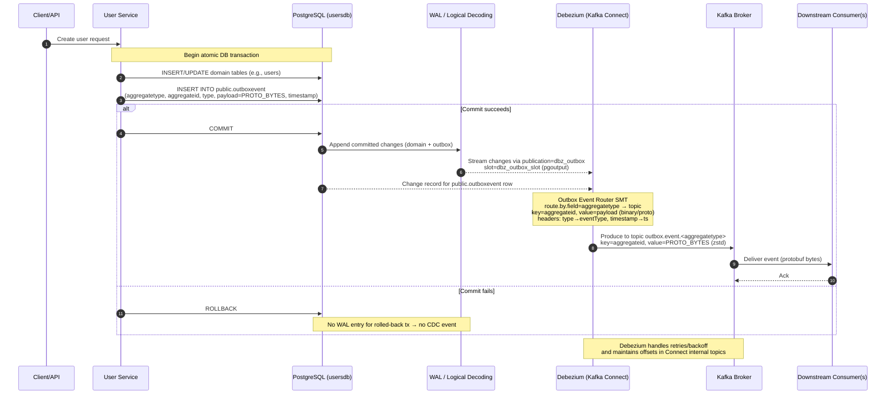

<Tldr>
  We stopped publishing Kafka events directly from our service code and moved to
  **Change Data Capture (CDC)** with the **Outbox pattern** using **Debezium**.
  This gives us atomic DB writes + event publication, even across failures, and
  it's fully automated on Kubernetes via Helm.

One connector, one table, zero dual-write bugs. Debezium tails the WAL so
your service code never needs to think about Kafka again — just write to the
DB and the event follows.

</Tldr>

## The problem we had

Our services used to write to the database and then publish a Kafka event in the same request handler:

```go
if err := s.repo.CreateUserRepo(ctx, user); err != nil {
    return err
}

redis.SetUserInRedis(ctx, string(user.UserId), user, 14*24*time.Hour)

kafka.ProduceUserEvents(
    models.TopicUsersAccounts,
    models.EventTypeAccountCreated,
    user.ToProto(),
)
```

This "double write" can fail halfway:

- DB commit **succeeds**, but the **Kafka publish fails** (process crash, network hiccup, broker down).
- Or we update multiple external stores (e.g., Redis + Kafka) and only some succeed → **inconsistent state**.

We wanted **guaranteed, exactly-once semantics** from the service's perspective without building custom retry/poison logic per handler. <NoteRef n={1} />

<Note n={1} kind="note">
  The "dual write" problem is one of the most common sources of data
  inconsistency in distributed systems. Martin Kleppmann covers this extensively
  in *Designing Data-Intensive Applications*, Chapter 11.
</Note>

## The outbox pattern (with Debezium)

Instead of publishing to Kafka in the handler, the service **writes a row into an `outboxevent` table** in the same DB **transaction** as the domain change. Debezium tails the database (logical decoding) and **emits an event** for each outbox row.

**Atomicity:** if the DB transaction rolls back, **no event** is emitted. If it commits, Debezium will **eventually** publish the event even if the service or broker restarts. <NoteRef n={2} />

<Note n={2} kind="note">
  The outbox pattern was popularized by [Chris
  Richardson](https://microservices.io/patterns/data/transactional-outbox.html)
  and later formalized by Debezium's maintainers at Red Hat. It's now considered
  a standard approach for reliable event publishing in microservices.
</Note>

**High level flow:**



## Why Debezium's Outbox Event Router?

Debezium ships a Single Message Transform (SMT) tailor-made for the outbox pattern. It:

- Routes events to topics based on a column (e.g., `aggregatetype` → `outbox.event.users`).
- Picks your event **key** (`aggregateid`).
- Copies selected columns to Kafka **headers** (e.g., `type` → `eventType`, `timestamp` → `ts`).
- Leaves the **payload** untouched (we put **protobuf bytes** in a `bytea` column).

We evaluated producing Protobuf directly from Debezium vs JSON. Debezium itself doesn't "know" Buf's Schema Registry, but by storing **protobuf bytes** in `payload` and using Debezium's `BinaryDataConverter`, we publish **proto** cleanly (no JSON bloat). For consumers that prefer JSON, you can choose JSON for those topics — outbox lets you decide per stream. <NoteRef n={3} />

<Note
  n={3}
  kind="link"
  title="Debezium Outbox Event Router docs"
  host="debezium.io"
  glyph="§"
>
  https://debezium.io/documentation/reference/stable/transformations/outbox-event-router.html
</Note>

## Kubernetes deployment with Helm

We deploy our kafka connectors on Kubernetes and use Helm charts as cluster package manager. We have a dedicated repository for all our connectors and configurations.

### Deployment template

```yaml
apiVersion: apps/v1
kind: Deployment
metadata:
  name: {{ .Release.Name }}-kafka-connect
  labels:
    app.kubernetes.io/name: kafka-connect
    app.kubernetes.io/instance: {{ .Release.Name }}
spec:
  replicas: {{ .Values.replicaCount }}
  selector:
    matchLabels:
      app.kubernetes.io/name: kafka-connect
      app.kubernetes.io/instance: {{ .Release.Name }}
  template:
    metadata:
      labels:
        app.kubernetes.io/name: kafka-connect
        app.kubernetes.io/instance: {{ .Release.Name }}
    spec:
      containers:
        - name: kafka-connect
          image: "{{ .Values.image.repository }}:{{ .Values.image.tag }}"
          imagePullPolicy: {{ .Values.image.pullPolicy }}
          ports:
            - name: http
              containerPort: 8083
          env:
            {{- range .Values.env }}
            - name: {{ .name }}
              value: "{{ .value }}"
            {{- end }}
          resources:
            {{- toYaml .Values.resources | nindent 12 }}
          readinessProbe:
            httpGet:
              path: "/"
              port: http
            initialDelaySeconds: 10
            periodSeconds: 10
          livenessProbe:
            httpGet:
              path: "/"
              port: http
            initialDelaySeconds: 20
            periodSeconds: 20
          volumeMounts:
            {{- if .Values.extraVolumeMounts }}
            {{- toYaml .Values.extraVolumeMounts | nindent 12 }}
            {{- end }}
      volumes:
        {{- if .Values.extraVolumes }}
        {{- toYaml .Values.extraVolumes | nindent 8 }}
        {{- end }}
```

**Worker env specifics** (values.yaml):

- `BOOTSTRAP_SERVERS`: make sure k3d can reach your broker (often `host.k3d.internal:9092` on Mac).
- `PLUGIN_PATH=/kafka/connect`
- **FileConfigProvider** so we can reference secrets in the connector JSON:
  - `CONFIG_PROVIDERS=file`
  - `CONFIG_PROVIDERS_FILE_CLASS=org.apache.kafka.common.config.provider.FileConfigProvider`

We also mount a **Secret** containing `/opt/kafka/external-configuration/db.properties` with DB creds/host.

### Service

```yaml
apiVersion: v1
kind: Service
metadata:
  name: {{ .Release.Name }}-kafka-connect
spec:
  type: {{ .Values.service.type }}
  selector:
    app.kubernetes.io/name: kafka-connect
    app.kubernetes.io/instance: {{ .Release.Name }}
  ports:
    - name: http
      port: {{ .Values.service.port }}
      targetPort: 8083
```

### Connector ConfigMap

Here is the full connector configuration we deploy via ConfigMap. <NoteRef n={4} />

```json
{
  "connector.class": "io.debezium.connector.postgresql.PostgresConnector",
  "tasks.max": "1",
  "topic.prefix": "pg",

  "database.hostname": "${file:/opt/kafka/external-configuration/db.properties:database.hostname}",
  "database.port": "${file:/opt/kafka/external-configuration/db.properties:database.port}",
  "database.user": "${file:/opt/kafka/external-configuration/db.properties:database.user}",
  "database.password": "${file:/opt/kafka/external-configuration/db.properties:database.password}",
  "database.dbname": "${file:/opt/kafka/external-configuration/db.properties:database.dbname}",

  "plugin.name": "pgoutput",
  "slot.name": "dbz_outbox_slot",
  "publication.name": "dbz_outbox",
  "publication.autocreate.mode": "disabled",

  "table.include.list": "public.outboxevent",
  "snapshot.mode": "never",
  "include.schema.changes": "false",

  "transforms": "outbox",
  "transforms.outbox.type": "io.debezium.transforms.outbox.EventRouter",
  "transforms.outbox.route.by.field": "aggregatetype",
  "transforms.outbox.route.topic.replacement": "outbox.event.${routedByValue}",
  "transforms.outbox.table.field.event.key": "aggregateid",
  "transforms.outbox.table.field.event.payload": "payload",
  "transforms.outbox.table.fields.additional.placement": "type:header:eventType,timestamp:header:ts",

  "key.converter": "org.apache.kafka.connect.storage.StringConverter",
  "value.converter": "io.debezium.converters.BinaryDataConverter",
  "producer.override.compression.type": "zstd"
}
```

<Note n={4} kind="note">
  The `snapshot.mode=never` is key for a pure outbox table — we don't want
  Debezium to snapshot existing rows on startup, only tail new inserts. Combined
  with `table.include.list: public.outboxevent`, Debezium ignores all other
  tables entirely.
</Note>

**What each bit does:**

- **database.\***: pulled from our mounted `/opt/kafka/external-configuration/db.properties` via FileConfigProvider.
- **pgoutput + slot/publication**: logical decoding setup (we create publication via Flyway).
- **table.include.list**: only read `public.outboxevent`.
- **snapshot.mode=never**: don't snapshot history; only tail new changes.
- **Outbox SMT**:
  - `route.by.field=aggregatetype` → topic `outbox.event.${routedByValue}` (e.g., `users` → `outbox.event.users`)
  - `event.key=aggregateid` → Kafka key is the aggregate ID.
  - `event.payload=payload` → pick our `bytea` column as the message **value**.
  - `additional.placement`: copy `type` → header `eventType`, and `timestamp` → header `ts`.
- **Converters**: keys are strings, **values are binary** via `BinaryDataConverter` (protobuf bytes pass through untouched).
- **Compression**: zstd on the producer.

## Why we need a Helm hook Job

Kafka Connect **doesn't read ConfigMaps** to create connectors. You must **POST/PUT** JSON to its REST API. We added a hook Job that:

1. Waits for `/connector-plugins`,
2. `PUT`s our JSON (idempotent: create or update),
3. Prints HTTP code + body so CI/CD logs are useful.

```yaml
apiVersion: batch/v1
kind: Job
metadata:
  name: {{ .Release.Name }}-apply-connector
  annotations:
    "helm.sh/hook": post-install,post-upgrade
    "helm.sh/hook-weight": "10"
    "helm.sh/hook-delete-policy": before-hook-creation,hook-succeeded
spec:
  template:
    spec:
      restartPolicy: Never
      containers:
        - name: apply
          image: curlimages/curl:8.8.0
          env:
            - name: CONNECT_URL
              value: "http://{{ .Release.Name }}-kafka-connect.{{ .Release.Namespace }}.svc:8083"
          volumeMounts:
            - name: cfg
              mountPath: /cfg
          args:
            - /bin/sh
            - -ec
            - |
              echo "Waiting for Connect REST..."
              i=0
              until curl -s "${CONNECT_URL}/connector-plugins" >/dev/null; do
                i=$((i+1)); if [ "$i" -gt 60 ]; then echo "Connect not ready"; exit 1; fi
                sleep 2
              done

              echo "Applying pg-outbox connector..."
              resp="$(curl -s -w '\n%{http_code}' -X PUT \
                "${CONNECT_URL}/connectors/pg-outbox/config" \
                -H 'Content-Type: application/json' \
                --data-binary @/cfg/pg-outbox-config.json)"
              code="$(echo "$resp" | tail -n1)"
              body="$(echo "$resp" | sed '$d')"
              echo "HTTP $code"
              echo "$body"
              test "$code" -ge 200 -a "$code" -lt 300
              echo "Done."
      volumes:
        - name: cfg
          configMap:
            name: usersdb-pg-proto-outbox-config
```

## Flyway migration (DB role, table, grants, publication)

Now we need an outbox table that Debezium can listen for change logs and fire events based on every row inserted. Columns in the table define topic, key, event headers, and data to be produced. <NoteRef n={5} />

```sql
-- 1) Debezium role (needs REPLICATION)
DO $$
BEGIN
  IF NOT EXISTS (SELECT 1 FROM pg_roles WHERE rolname = 'debezium') THEN
    CREATE ROLE debezium WITH LOGIN PASSWORD '${DEBEZIUM_PASSWORD}';
    ALTER ROLE debezium REPLICATION;
  END IF;
END$$;

-- 2) Outbox table
CREATE TABLE IF NOT EXISTS public.outboxevent (
  id             uuid PRIMARY KEY,
  aggregatetype  text NOT NULL,
  aggregateid    text NOT NULL,
  type           text NOT NULL,
  payload        bytea NOT NULL,
  timestamp      timestamptz NOT NULL DEFAULT now()
);

-- 3) Grants
GRANT CONNECT ON DATABASE ${DB_NAME} TO debezium;
GRANT USAGE ON SCHEMA public TO debezium;
GRANT SELECT ON TABLE public.outboxevent TO debezium;

-- 4) Publication
DO $$
BEGIN
  IF NOT EXISTS (SELECT 1 FROM pg_publication WHERE pubname = 'dbz_outbox') THEN
    CREATE PUBLICATION dbz_outbox FOR TABLE public.outboxevent;
  END IF;
END$$;
```

<Note n={5} kind="note">
  The `aggregatetype` column maps to the Kafka topic via the Outbox SMT routing.
  For example, inserting a row with `aggregatetype = 'users'` produces to
  `outbox.event.users`. The `aggregateid` becomes the Kafka message key, which
  controls partitioning — so all events for the same entity land on the same
  partition in order.
</Note>

Now in your service, your handler can write domain row and outbox row in the same DB transaction — events fire automatically, and even in case of failures your data won't remain inconsistent across services:

```go
tx, err := db.BeginTx(ctx, nil)
if err != nil { return err }
defer tx.Rollback()

if err := repo.CreateUserTx(ctx, tx, user); err != nil {
    return err
}

out := OutboxEvent{
    ID:            uuid.New(),
    AggregateType: "users",
    AggregateID:   user.ID,
    Type:          "UserCreated",
    Payload:       user.ToProtoBytes(),
    Timestamp:     time.Now().UTC(),
}
if err := repo.InsertOutboxTx(ctx, tx, out); err != nil {
    return err
}

if err := tx.Commit(); err != nil { return err }
```

## Sanity checks

Once deployed, verify Kafka Connect is up and the connector is running. <NoteRef n={6} />

**Is Connect up?**

```bash
kubectl -n kafka-connect rollout status deploy/connect-kafka-connect
kubectl -n kafka-connect run curl --rm -i --image=curlimages/curl:8.8.0 -- \
  sh -c 'curl -s http://connect-kafka-connect:8083/connector-plugins'
```

**Connector status:**

```bash
kubectl -n kafka-connect run curl --rm -i --image=curlimages/curl:8.8.0 -- \
  sh -c 'curl -s http://connect-kafka-connect:8083/connectors/pg-outbox/status'
```

**Nothing in topic?** Insert a test row and consume:

```sql
INSERT INTO public.outboxevent
  (id, aggregatetype, aggregateid, type, payload, timestamp)
VALUES
  (gen_random_uuid(), 'users', 'u-123', 'UserCreated',
   '\xDEADBEEF'::bytea, now());
```

```bash
kafka-console-consumer --bootstrap-server localhost:9092 \
  --topic outbox.event.users --from-beginning \
  --property print.key=true --property print.headers=true
```

<Note n={6} kind="note">
**Common gotchas:** Placeholders like `${file:...}` failing → FileConfigProvider not enabled or secret file not mounted. `NoSuchFileException` → your Secret doesn't contain `db.properties`. Connect logs `Node … disconnected` → broker advertised.listeners/reachability mismatch (k3d often needs `host.k3d.internal:9092`). `publication not found` → run the Flyway migration first.
</Note>

**Postgres settings** for logical decoding (self-managed):

```ini
wal_level=logical
max_wal_senders≥connectors
max_replication_slots≥connectors
max_slot_wal_keep_size (cap WAL bloat)
```

## Conclusion

Moving from "publish in handlers" to **Debezium CDC + Outbox** eliminated inconsistent writes and made our eventing **durable and deterministic**. The entire stack is declarative (Helm + Flyway), easy to roll forward/back, and portable from local k3d to production.

> The interesting question isn't _can Debezium tail your WAL_. It's _what happens when it lags by 30 seconds and your service already retried_. The outbox gives you the answer: the event still lands exactly once, because the DB transaction was the source of truth all along.

If you're in the same spot — publishing Kafka events directly from service code — this pattern will save you from subtle data loss and late-night incident drills.
